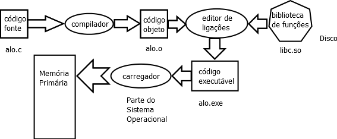

# Introdução a LP

## Ementa

> Lógica de Programação e suas representações. Construção de Algoritmos.
> Constantes e Variáveis. Estrutura de Controle Linear e Condicional Simples
> e Composta. Estrutura de Controle de Repetição. Estruturas de Dados
>  Homogêneas: Vetores.

### Objetivo

> Apresentar os fundamentos para a programação de computadores.

### Competências

- Identificar os elementos de uma linguagem de programação
- Compreender os tipos básicos de dados e as estruturas de controle de fluxo de instruções
- Analisar os tipos de problemas simples que podem ser resolvidos com a programação de computadores

### Habilidades

- Projetar pequenos programas
- Especificar soluções computacionais para problemas de pequena dimensão em computação
- Analisar problemas computacionais
- Programar pequenas aplicações

### Bibliografia

#### Básica

1. MANZANO, José Augusto N.G.; OLIVEIRA, Jayr Figueiredo, Algoritmos: lógica para desenvolvimento de programação de computadores, 28. ed, Saraiva, 2016.

2. SOFFNER, Renato, Algoritmos e programação em linguagem em C, Saraiva, 2013.

3. IEPSEN, Edécio Fernando, Lógica de programação com JavaScript: uma introdução à programação de computadores com exemplos e exercícios para iniciantes, NOVATEC,2018.

#### Complementar

1.	ALVER, William Pereira, Linguagem e lógica de programação, Érica, 2014.

2.	SANTOS, Marcela Gonçalves dos, Algoritmos e programação, SAGAH, 2018.

3.	SEBESTA, Robert W., Conceitos de Linguagens de Programação, 9ªEd., Bookman, 2011.

4.	MONK, Simon, Programação com Arduino: começando com o sketches, SAGAH, 2017.

5.	MACHADO, Rodrigo Prestes; FRANCO, Márcia Islabão; BERTAGNOLLI, Silvia de Castro, Desenvolvimento de Software III: programação de sistemas web orientada a objetos em Java, SAGAH, 2016.

## Compilação

Um programa é um texto com um conjunto de instruções em alguma linguagem de
programação. Ele normalmente é armazenado num arquivo numa memória
permanente de um computador. Este programa não é diretamente executável.
O computador executa programas em linguagem de máquina - código binário.
Para executar o programa escrito em linguagem de programação, este programa
precisa ser traduzido para a linguagem do computador. O programa que faz
esta tradução é o **compilador**.

A figura abaixo ilustra a compilação do programa `alo.c`.



O programa `alo.c` tem o seguinte texto:

```C
#include <stdio.h>

int main() {
  printf("Alo, Mamae!\n");
  return 0;
}
```

O código em linguagem C é um texto que o computador não entende. O compilador
o converte para um *código objeto*. O arquivo `alo.o` é em código objeto.
Este já é um código binário com as instruções em código de máquina, mas este
código é relocável, isto é, ainda não tem sua posição na memória definida. O
código faz referência à posição de suas instruções e dados e estas posições
ainda não estão definidas.

O código também faz referência a funções pré-definidas \(`printf()`\) e o
código destas funções estão em bibliotecas \(arquivo `libc.so`\) no disco do
computador. O *editor de ligações* reune estes códigos objetos e calcula a
posição em que eles devem ficar na memória resolvendo \(calculando\) os
endereços que devem ser usados. O *editor de ligações* gera o arquivo
executável, `alo.exe`.

O processador não acessa as instruções no disco, ele precisa que as instruções
estejam na memória principal, o *Sistema Operacional*, *SO*, "carrega" o arquivo
executável numa área pré-definida da memória principal e passa o fluxo de
instruções para o programa carregado. Quando o programa termina, o *SO*
volta a executar.

## Linguagem de Máquina x *Assembly*

Seres humanos não programam em código binário, com exceções excêntricas, o
mais próximo da linguagem de máuina que seres humanos programam é em linguagem
*Assembly*. *Assembly* usa mnemônicos \(palavras que imitam algo\) para as
instruções de máquina em vez de usar códigos binários. Além disso, na
programação em *Assembly* são usados *rótulos* \(*labels*\) no lugar de
endereços. Os *rótulos* são identificadores que facilitam entender que trecho
de código corresponde a uma função ou um bloco de dados. Uma tabela liga os
nomes com os endereços. Esta tabela é chamada de tabela de símbolos. Os
compiladores trabalham com tabelas de símbolos mais complexas, mas uma das
funções da tabela de símbolos é estabelecer este tipo de relacionamento entre
identificadores e endereços. Programas em Assembly são convertidos para
linguagens de máquina por um *assembler*, chamado em português de *montador*.

O *montador* usa uma tabela de símbolos fornecida no programa Assembly pelo
programador para converter os *rótulos* em endereços. Se for necessários,
o *montador* calcula o endereço a partir de outros endereços, somando os
deslocamentos necessários de acordo com o número de bytes necessários
para as instruções e os dados.

## Compilação x Interpretação

Existem linguagens de programação cujos programas fontes não são compilados
para códigos de máquina do computador onde eles são executados.
Nestes casos, o programa fonte pode ser interpretado
por um *interpretador*, isto é, o *interpretador* serve de intermediário e
dinamicamente, converte o código fonte em instruções de máquina durante a
execução do programa. Diferente do compilador que converte o programa antes
da sua execução. Um esquema
intermediário bastante usado atualmente é a compilação do código fonte para
um código numa linguagem intermediária e o código da linguagem intermediária
é que é interpretado. Isto acontece com o Java que é compilado em *Java Byte
Code* e o código em Java Byte Code é interpretado por uma *JVM*, *Java Virtual
Machine*.
Algumas linguagens que eram interpretadas antes, agora também são compiladas em
código intermediário dinamicamente. Entretanto, não existe a geração de arquivo
compilado em algum tipo de código intermediário, o código compilado fica na
memória principal e é interpretado a partir de lá. Isto ocorre, por
exemplo com o Lisp e o Perl.
