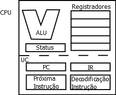

% Aula 2 de Lógica de Programação
% Paulino Ng
% 2019-08-20

Nesta aula são vistos alguns conceitos básicos de computação para podermos
entender melhor alguns conceitos de programação que serão vistos posteriormente.
Começamos pela arquitetura de *von Neumann* que descreve conceitualmente
a estrutura dos computadores modernos. Veremos como isto afeta a
programação dos computadores e como as linguagens de programação procuram
fornecer uma abstração de alto nível para que não tenhamos de programar
num nível conceitual próximo ao da máquina computacional.

Lembre-se de que nesta disciplina só nos interessa o computador digital.
No computador digital, a unidade de informação é um *bit*.
Um *bit* é algo que pode ter apenas 2 valores \(estados\), **0** ou **1**.
Fisicamente o bit pode ser um sinal elétrico do tipo tensão
\(tensão baixa, quase zero, é **0**, alta, 2 a 5V,
  ou mais, é **1**, presença de corrente é **1**, corrente nula é **0**,
  frequência baixa é **1**, alta é **0**, enfim, escolha-se uma convenção para
  um tipo de implementação e defina-se  o significado do bit e seus valores\),
pode-se ter diversas outras *convenções*.

## Arquitetura de *von Neumann*

[John von Neumann](https://en.wikipedia.org/wiki/John_von_Neumann), um
cientista, matemático e físico húngaro-americano, considerado como o
último dos grandes matemáticos, é o autor de um artigo que descreve um dos
primeiros computadores da história. Não vou reproduzir exatamente a arquitetura
do artigo, mas resumir de maneira mais moderna o que foi proposto.

Antes, vamos entender o conceito de arquitetura de computador. É bem similar
ao conceito de arquitetura de edificações. É óbvio que a arquitetura tem
a ver com a estrutura física, mas não necessariamente com a realização
material dela.
Como na construção civil, o engenheiro civil está preocupado com
a realização física do prédio, o arquiteto está preocupado com aspectos
funcionais, estéticos, ambientais, visuais, ...
Na computação, o arquiteto de um
computador se preocupa com funcionalidades dos componentes do computador,
conjunto de instruções do processador, protocolos de comunicação entre os
componentes do computador, ...
Os engenheiros de computação, projetistas de hardware, HW, são as pessoas
preocupadas em realizar fisicamente, dizemos implementar o computador.
Veremos a arquitetura, não a implementação.

### Componentes da arquitetura de *von Neumann*

Os componentes da arquitetura de *von Neumann* são:

1. **Processador**: responsável por executar as instruções
2. **Memória**: responsável por armazenar os dados e as instruções
3. **Barramento**: responsável pela comunicação entre os componentes
4. **Entradas**: responsável por capturar/receber os dados externos ao computador
5. **Saídas**: responsável por enviar os dados para o meios externos ao computador

### Memória principal do computador

Ela é formada pelos módulos de memória DDR nos PCs e notebooks que os alunos
usam. As instruções e os dados a serem acessados pelo processador ficam na
memória principal.
A memória pode ser entendida como uma tabela onde são guardados os dados e as
instruções do computador. Na tecnologia atual, a tabela tem uma única coluna
e em cada linha temos um *byte* \(8 bits\).
Para acessar um *byte* específico, é preciso fornece a linha onde ele está.
A linha é chamada de *endereço*. A memória é acessada através de 3 barramentos:

1. Barramento de dados: por onde circulam os *bytes* de dados da memória.
2. Barramento de endereços: determinam o endereço \(linha\) do\(s\) byte\(s\).
3. Barramento de controle: determina o tipo de operação que é feita no
  endereço. Se for *leitura*, a memória coloca o dado do endereço solicitado no
  barramento de dados, se for *escrita*, a memória grava o dado no endereço
  solicitado.

### Processador

O processador é responsável pela *execução* das instruções dos programas.
Os principais blocos funcionais de um processador \(*CPU - Central Processing
  Unit*\) são ilustrados na figura 2.

  

A figura 2 não mostra as interconexões, barramentos internos, que ligam os
blocos funcionais e suas ligações com o exterior.

* ALU - *Arithmetic Logic Unit*: Unidade Lógico-Aritmética \(ULA\), circuito
combinacional que recebe 2 operandos e realiza operações de adição, substração,
multiplicação e divisão inteira em representação de complemento de 2 e as
operações lógicas bit-a-bit nos 2 operandos, os sinais vindos da decodificação
da instrução comandam a operação a ser feita. Os operandos vêm dos registradores
e o resultado é armazenado em algum registrador. A decodificação determina
quais são os registradores envolvidos.

* Registradores: circuitos de memorização rápidos \(*SRAM*\). Cada registrador
armazena uma palavra \(*vários bytes*\). Servem para armazenar os
dados que são manipulados pelas instruções do processador. Na tecnologia atual,
a manipulação direta de dados na memória principal causaria muito retardo na
execução das instruções. Isto porque o aumento de velocidade dos circuitos
digitais da ALU não foi acompanhado pela velocidade de acesso à memória
*DRAM*.

* *Status*: Registrador da palavra de *status* que contém as *flags* que
armazenam condições resultantes da execução da última instrução. *Flags* são
*bits* de memória que indicam, por exemplo, que a última operação da ALU
resultou em ZERO, um valor negativo, positivo, *overflow* \(estouro\), ...
Existem instruções que testam estas condições e realizam desvios condicionais
no fluxo de instruções de acordo com o valor de uma *flag*.

* UC - Unidade de Controle: Como o nome sugere, este é o circuito que controla
as operações realizadas no processador e gera sinais de controle também para os
outros componentes dos computador \(estes sinais são transmitidos através dos
  barramentos\). Os sinais de controle são gerados pelos circuitos interpretando
as instruções que o processador deve executar.
A unidade de controle é um circuito sequencial bastante complexo e diferentes
técnicas foram usadas para o projeto da unidade de controle. Nos primeiros
circuitos VLSI era comum usar PLAs, microprogramação, nanoprogramação. Apenas
os processadores mais simples usavam *lógica aleatória*. Com o aumento da
velocidade, uso de técnicas de *pipeline* com muitos estágios, etc. O uso de
lógica aleatória se tornou obrigatório.

* IR - *Instruction Register*: registrador de instrução, armazena a instrução que
está sendo executada neste instante.

* Decodificação Instrução: a máquina de estado que decodifica a instrução do IR
e gera os sinais de controle para a execução da instrução.

* Próxima Instrução: calcula o endereço da próxima instrução. No modelo da
máquina de von Neumann, o endereço da próxima instrução, em geral, é a instrução
seguinte. Isto é, o endereço da instrução atual mais o número de bytes da
instrução. A exceção é se a instrução atual causa um desvio condicional, ou
não. Ou se existe um desvio provocado por uma condição de *HW* \(interrupção\).

* PC - *Program Counter*: registrador que armazena o endereço da próxima
instrução.

O processador funciona basicamente seguindo continuamente um ciclo de busca
de instrução na memória primária e execução. O projeto lógico do processador
determina o conjunto de instruções que o processador é capaz de executar.
Os blocos funcionais e o conjunto de instruções do processador formam
a arquitetura de um processador e, em geral, determinam a arquitetura de um
computador.

### Barramento

Sistema de comunicação que interliga os outros componentes permitindo a
transferência de dados/instruções.

### Entradas e Saídas

Componentes que permitem adquirir dados de e enviar dados para fora do
computador. Geralmente, são compostos por duas partes: um controlador
de dispositivo e um periférico.

## Linguagens de Programação

Programar diretamente na linguagem do computador é muito complicado para
seres humanos. A linguagem mais próxima da linguagem de máquina é a linguagem
*Assembly* que usa mnemônicos para as instruções. Os mnemônicos são palavras, ou
siglas/abreviações, que em inglês lembram o que a instrução faz. Exemplos de
mnemônicos são: MOV, CPY, CMP, JMP, JZ, JC, ADD, SUB, MUL, DIV, ...
Algumas instruções de máquina precisam dos endereços de memórias de dados ou de
instruções, para não ficar usando números sem significados, o *Assembly* permite
o uso de *rótulos* para os endereços e o programador pode definir o valor destes
*rótulos* ou deixar o *Assembler* calcular o endereço a ser usado. O *Assembler*
é o programa que converte o texto *Assembly* \(programa *Assembly*\) em
linguagem de máquina. Em português, chamamos o *Assembler* de *montador*.

Alguns pequenos programas \(subprogramas\) são escritos em *Assembly* por
precisarem acessar detalhes de *hardware* que não são acessíveis com linguagens
de alto nível, como partes de um *driver* de *SO* ou por necessitarem de
um desempenho melhor do que o compilador pode oferecer. Observe que compiladores
modernos são capazes de otimizar o código muito melhor do que a maioria dos
programadores. A programação de microcontroladores muitas vezes é realizada em
*Assembly*.

### Conceitos de mais alto nível

As linguagens de programação procuram proporcionar conceitos de mais alto nível
e esconder conceitos de baixo nível. Assim, linguagens estruturadas fornecem
estruturas de fluxo de instruções que eliminam os desvios incondicionais que
Dijkstra denunciou como culpados por muitos erros de programação. No lugar de
desvios, usam-se estruturas sequenciais, condicionais, de repetição e chamada
de sub-programas \(funções ou procedimentos\).

#### Tipos de dados

O hardware do computador praticamente só conhece valores binários \(digitais\).
Estes não são facilmente interpretados por seres humanos. É mais compreensível
entender os dados do mundo real com números decimais, reais e textos.
As linguagens de programação fornecem representações binárias para estes tipos
de dados livrando o programador das representações binárias na maior parte do
tempo. Assim, as linguagens de programação oferecem tipos de dados inteiros,
ponto flutuante para números reais, caracteres em algum tipo de codificação.
Atualmente, usa-se muito a codificação ASCII e a UTF-8. Os textos são formados
com sequências de caracteres.

#### Estruturas de controle de fluxo de instrução

As instruções na maioria das linguagens de programação são supostas serem
executadas **sequencialmente**. A sequência das instruções pode precisar
seguir caminhos diferentes dependendo do valor de alguns dados. Isto é obtido
com instruções condicionais. Em que o valor de uma condição determina o fluxo
de instruções a ser seguido.

Frequentemente, uma sequência de instruções precisa ser repetida, para tanto,
usa-se as **instruções de repetição**.

Muitas vezes, percebe-se que trechos de código realizam um tipo de processamento
bastante específico e precisamos usar este tipo de processamento em diferentes
programas e partes de programas. Este tipo de ideia sugere que existem
subprogramas que são repetidamente usados nos programas. O conceito de
subprograma foi expandido e a instrução que usa um subprograma é denominada
de **chamada de subprograma**. Apesar de rodar o mesmo código em cada chamada
de subprograma, podemos querer mudar alguns dados que são processados pelo
subprograma. Estes dados que mudam de chamada para chamada de subprograma são
chamados de **parâmetros** dos subprogramas. Os valores dos dados que são passados
para os subprogramas são chamados de **argumentos**. Muitas vezes os termos
parâmetros e argumentos são usados como sinônimos, apesar de não serem. Nesta
disciplina vamos usá-los como sinônimos.

Os subprogramas podem ser divididos em 2 tipos diferentes: **funções** e
**procedimentos**. As funções procuram calcular algo baseados nos valores dos
argumentos na chamada. Elas sempre retornam um valor. Os procedimentos podem
realizar tarefas diferentes, em geral, interações com os meios externos ou
alterações dos estados de dados globais. Os procedimentos não retornam valores.

A chamada de um subprograma desvia o fluxo de instruções para o subprograma. O
subprograma retorna ao programa \(ou subprograma\) que o chamou quando termina.

### Subprogramas

A ideia de subprograma é bastante simples: Existem trechos de programas que
precisamos escrever repetidamente. Para evitar estas reescritas que deixam
o texto do programa muito grande. Sempre que estes trechos repetitivos
executam uma tarefa muito bem definida, transformamos estes trechos em
subprogramas. No lugar onde escreveríamos estes trechos de código, chamamos
o subprograma que realiza a tarefa. Em linguagens antigas, existia uma
instrução `CALL` para chamar os subprogramas. Em linguagens mais modernas,
os subprogramas são chamados de *funções* quando retornam valores e
*procedimentos* quando não retornam nenhum valor. A chamada dos subprogramas
não precisam mais de um `CALL` explicito, basta escrever o nome da função, ou
do procedimento e a lista de argumentos, quando houver, entre parênteses, `()`.

A definição do código da função ou do procedimento é chamado de *implementação*
da função. O código do que a função deve executar é chamado de *corpo da função*.
