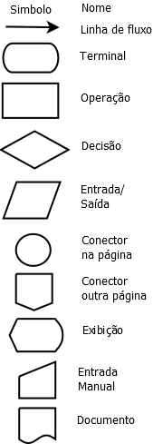
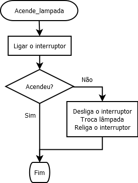
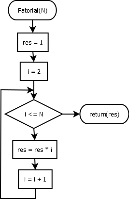

% Aula 3 de Lógica de Programação
% Paulino Ng
% 2019-08-27

## Fluxogramas

Este é um recurso gráfico antigo usado para modelar programas/algoritmos.
Este recurso, por muito tempo, foi relegado a um segundo plano devido ao uso de
pseudo-linguagens estruturadas para representar algoritmos. Agora, os
fluxogramas têm um renascimento devido ao uso da modelagem gráfica para o
projeto de sistemas de software com o *UML* - *Unified Modeling Languagem*.
Os fluxogramas são bastante usados para modelar/documentar *software* de
microcontroladores e sistemas de automação. Eles também são muito usados
quando o *SW* é escrito em *Assembly*.

Algoritmos são sempre descritos com um `início`, sequência de passos para
resolver um problema, `fim`. Os blocos básicos de um fluxograma são
representados abaixo:



* Linha de Fluxo: representa o fluxo, a ordem em que as operações/instruções são
executadas;

* Terminal: representa o início e o fim de um programa/processo/subprograma;

* Operação: representa uma operação/instrução que deve ser executada;

* Decisão: representa uma operação condicional \(um teste\) que divide o fluxo
em dois ou mais fluxos possíveis \(apenas um deles será seguido\);

* Entrada/Saída: representa o processo de entrada ou saída de dados;

* Conector na página: permite descontinuar um fluxo para outra posição na mesma
página, conectores sempre estão em pares \(com o mesmo rótulo\);

* Conector em outra página: permite continuar o fluxo numa outra página, para
fluxogramas muito grandes para uma única página;

* Exibição: mostra dados num monitor;

* Entrada manual: entrada de dados por um teclado;

* Documento: documento de saída.

<!--
A *elipse* é usada para representar o início e o fim do algoritmo/programa.
Um *retângulo* índica uma ação \(um passo, um processo\) que deve ser executado.
Um *losango* indica um teste que pode ter 2 \(ou 3\) resultados diferentes,
dependendo do resultado, o fluxo de passos muda.
O *paralelogramo* indica entrada ou saída de dados.
Os 2 últimos símbolos, os conectores, servem para indicar *continuações* do
fluxo de instruções/ações quando a página do desenho/gráfico acaba. A *bolinha*
indica que a continuação está na mesma página. O *pentagono* com a ponta para
baixo indica que a continuação está em outra página.
O *retângulo com barras* indica a ativação/chamada de um
sub-processo/subprograma.
-->

Exemplo de fluxograma:



O fluxograma acima representa o processo para acender a luz numa sala:

1. liga o interruptor

2. se a luz acendeu, vá para o passo 4

3. se não acendeu: <br>
3.1 desliga o interruptor<br>
3.2 troca a lâmpada<br>
3.3 liga o interruptor<br>

4. termina

Em geral, não usaremos os fluxogramas no dia-a-dia.
Mas, usaremos fluxogramas para entender as estruturas de controle de
linguagens de programação
para a repetição de blocos de instruções e instruções condicionais.


## Estruturas de Repetição

É muito comum precisarmos repetir um bloco de instruções \(passos\) nos
programas, as estruturas de programação que permitem estas repetições são:

- `repita <bloco de instrução> até <condição de parada>`, ou o equivalente
`faça <bloco de instruções> enquanto <condição de continuidade>`
- `enquanto <condição de continuidade> faça <bloco de instruções>`
- `para <inicialização>; <condição de continuidade>; <incremento> faça <bloco>`

Observe que a primeira destas estruturas é a única que obrigatoriamente executa
o bloco de instruções pelo menos uma vez, as outras podem não executar o
bloco de instruções se a condição de continuidade for falsa desde o início.

É óbvio que se desejamos que a repetição se encerre em algum momento, o bloco de
instruções deve resultar em continuidade falsa ou parada verdadeira em algum
momento. Se não teremos um *loop infinito*, i.e., uma malha de repetição que
continua a executar seu bloco de instruções até que o computador seja desligado
ou o processo de execução terminado externamente.

A seguir, as 3 malhas de repetição são ilustradas com os fluxogramas
equivalentes, para melhor fixar o funcionamento das estruturas.

### `repeat ... until condição` ou <br> `do { ... } while (condição)`


As instruções `...` são repetidas até a `condição` ser verdadeira, na primeira
forma e até a `condição` ser falsa na forma com  `do ... while`. Algum cuidado
deve ser tomado aqui, frequentemente os programadores trocam as condições ao
trocar de linguagem. Observe que nesta estrutura, as instruções são executadas
pelo menos uma vez.

### `while (condição) ...`


Enquanto a `condição` for verdadeira a instrução \(ou o bloco de instruções\)
é executada. Lembre-se de que a instrução deve alterar o valor da `condição` de
verdadeira para falsa em algum momento.

### `for (...; ...; ...) { ... }`


Este é o formato do `for` em C/C++/Java. O primeiro `...` faz a *inicialização*
do `for`, geralmente, com uma ou mais atribuições, cada atribuição separada da
outra por `,` \(vírgula\). O segundo tem a `condição` de continuidade, se ela
for verdadeira, as instruções entre chaves, `{ ... }`, são executadas, se não,
o `for` termina. O terceiro elemento `...` dentro dos parenteses é executado
no final, depois das instruções a serem repetidas, e é chamado de *incremento*.
O *incremento*, geralmente, aumenta ou diminui uma variável de controle
inicializada na *inicialização* e testada na `condição`. Assim como na
*inicialização*, no *incremento* mais de uma variável pode ser modificada. Cada
modificação é separada da outra por `,` .

Em C/C++, é valido não colocar nada em qualquer um dos elementos dentro do `for`.
Assim, em C/C++, é possível escrever: `for ( ;; ) ;`

Esta instrução é um *loop infinito* que não faz nada. Programas de *driver* mal
escritos executavam este tipo de *loop* para esperar uma *interrupção* para
continuar.

#### Equivalência entre o for e o while do C/C++/Java.

O `for` pode ser escrito com um `while`:

```
inicialização;
while ( teste ) {
  { instruções a repetir; }
  incremento;
}
```

Ou um `while` pode ser substituído por um `for`:

```
for ( ; condição ; ) {
  ...
}
```

Observe que o `for` de linguagens como Pascal, Pyhton, ... difere desta
estrutura popularizada pelo C. Nestas outras linguagens, o `for` é uma estrutura
de repetição de contagem e executa a repetição um número exato de vezes que pode
ser determinado na entrada da malha de repetição.

## Exercícios

1. Calcular o fatorial de um N dado usando o `for`.

2. Calcular o n-ésimo elemento da sequência de Fibonacci (para casa).

3. Dado um texto, numa variável str, calcule o texto reverso. Suponha
disponíveis `length(str)`, função que retorna o número de caracteres de `str`,
`[i]` operador de índice que permite acessar o i-ésimo caracter da string e
`str.anexa(c)` que anexa, coloca no final, o caracter `c` na string `str`.

### Teste das soluções com *teste de mesa*

Suponha a seguinte solução para o exercício 1:

> 1. supondo que N é um inteiro declarado e inicializado, declaramos as variáveis i e res inteiras
> 2. res &larr; 1
> 3. for (i &larr; 2; i <= N; i++) res &larr; res * i <br>
> O resultado está em res

O fluxograma para o pseudo-código acima é dado por:



Para testar este programa, vamos *rodá-lo na mão* de modo sistemático.
Constrói-se uma tabela com uma coluna para cada variável e expressão cujo valor
tenhamos interesse, cada linha da tabela mostra os valores das variáveis para
cada iteração do `for` \(ou da estrutura de repetição que estamos analisando\).
Suponha que desejemos saber se o algoritmo/programa calcula o fatorial de 5
corretamente, teremos o seguinte teste de mesa:

+---+---+--------+-----+---------+
| i | N | i <= N | res | res * i |
+===+===+========+=====+=========+
| 2 | 5 | true   | 1   | 1 * 2   |
+---+---+--------+-----+---------+
| 3 | 5 | true   | 2   | 2 * 3   |
+---+---+--------+-----+---------+
| 4 | 5 | true   | 6   | 6 * 4   |
+---+---+--------+-----+---------+
| 5 | 5 | true   | 24  | 24 * 5  |
+---+---+--------+-----+---------+
| 6 | 5 | false  | 120 |   |
+---+---+--------+-----+---------+

#### Exercício

Teste sua solução para o exercício 2, da sequência de Fibonacci para N = 6.
