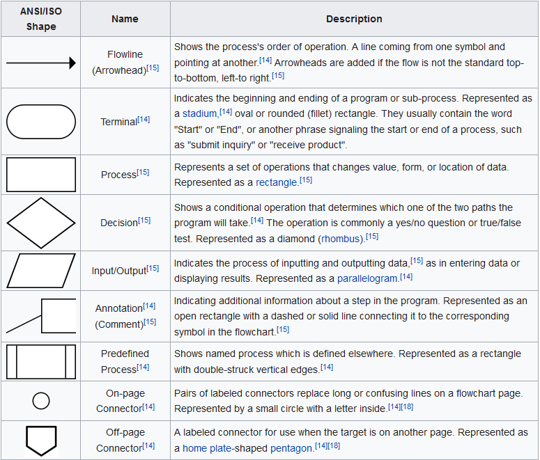

# Aula Lógica de Programação: 27/08/2019

## Fluxogramas

Este é um recurso gráfico antigo usado para modelar programas/algoritmos.
Este recurso, por muito tempo, foi relegado a um segundo plano devido ao uso de
pseudo-linguagens estruturadas para representar algoritmos. Agora, os
fluxogramas têm um renascimento devido ao uso da modelagem gráfica para o
projeto de sistemas de software com o *UML* - *Unified Modeling Languagem*.
Os fluxogramas são bastante usados para modelar/documentar *software* de
microcontroladores e sistemas de automação. Eles também são muito usados
quando o *SW* é escrito em *Assembly*.

Algoritmos são sempre descritos com um `início`, sequência de passos para
resolver um problema, `fim`. Os blocos básicos de um fluxograma são
representados abaixo:

Fonte: [Página da Wikipedia sobre Flowchart](https://en.wikipedia.org/wiki/Flowchart)

A *elipse* é usada para representar o início e o fim do algoritmo/programa.
Um *retângulo* índica uma ação \(um passo, um processo\) que deve ser executado.
Um *losango* indica um teste que pode ter 2 \(ou 3\) resultados diferentes,
dependendo do resultado, o fluxo de passos muda.
O *paralelogramo* indica entrada ou saída de dados.
Os 2 últimos símbolos, os conectores, servem para indicar *continuações* do
fluxo de instruções/ações quando a página do desenho/gráfico acaba. A *bolinha*
indica que a continuação está na mesma página. O *pentagono* com a ponta para
baixo indica que a continuação está em outra página.
O *retângulo com barras* indica a ativação/chamada de um
sub-proceso/subprograma.

Usaremos fluxogramas para entender inicialmente as estruturas de programação
para a repetição de blocos de instruções e instruções condicionais.
Em geral, não usaremos os fluxogramas no dia-a-dia.

## Estruturas de Repetição

### `repeat ... until condição` ou `do { ... } while (condição)`

### `while (condição) ...`

### `for (...; ...; ...) { ... }`

## Exercícios

1. Calcular o fatorial de um N dado usando o for

2. Calcular o n-ésimo elemento da sequência de Fibonacci (para casa)

3. Dado um texto, numa variável str, calcule o texto reverso. Suponha
disponíveis `length(str)`, função que retorna o número de caracteres de `str`,
`[i]` operador de índice que permite acessar o i-ésimo caracter da string e
`str.anexa(c)` que anexa, coloca no final, o caracter `c` na string `str`.

### Teste das soluções com *teste de mesa*
