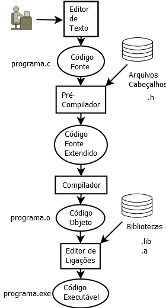
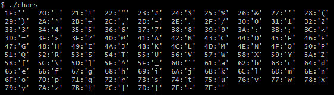

% Resumo de Programação C
% Paulino Ng
% 2019-09-30

> Advertência: Este é um trabalho em andamento (WIP - work-in-progress).

## Programa Alo

Seguindo os passos de [1], este resumo começa com o programa alo.c, cujo código
é:

```C
#include <stdio.h>

int main() {
  printf("Alo!\n");
  return 0;
}
```

A linha `#include <stdio.h>` pede para o pré-compilador do C incluir o arquivo
`stdio.h` no lugar da linha. Isto permite usar a chamada da função `printf()`.

Todo programa C deve ter uma implementação da função `main()`. Esta é a função
que o sistema operacional *chama* ao carregar o programa para a execução.

A função `main()` retorna um valor inteiro para indicar se o programa executou
corretamente ou não. Se a `main()` retorna `0` (zero), o programa executou sem
erros. Se executar com algum tipo de erro, o valor do retorno é diferente de
`0`.

Além da instrução de retorno, a única instrução dentro do corpo da `main()` é
a chamada à função `printf()`. A função `printf()` imprime uma mensagem
(*texto*) na tela do usuário (na *console* do usuário). A mensagem é o
argumento da chamada da função, `"Alo!\n"`. Este texto é chamado de *string* e
consiste na sequência de caracteres `'A'`, `'l'`, `'o'`, `'!'`, `'\n'` e `'\0'`.
O carácter `'\n'` é para terminar a linha do `"Alo!"` e começar um nova.

As instruções em C terminam com um `;` obrigatório.

## Etapas para a geração de um programa executável de C



O C é uma linguagem de programação compilada. Isto é, o código fonte precisa ser
compilado para poder ser executado, diferente de linguagem interpretada cujos
programas não precisam ser compilados para serem executados pelo interpretador.
Como ocorre com o Python.

A figura ilustra o código fonte que é inicialmente editado pelo programador com o
uso de um *editor de texto*. Isto resulta num arquivo `.c`. Este arquivo é
processado pelo pré-compilador que inclui os arquivos cabeçalhos, substitui as
macros, ... Os arquivos cabeçalhos têm extensão `.h`. Isto gera um arquivo
intermediário que é compilado pelo *compilador*.
O arquivo compilado é um código objeto, ou arquivo objeto.
Este arquivo é binário e já
possui as instruções de máquina da tradução das instruções C do código fonte.
Este código, entretanto ainda não pode ser executado, pois falta o código
das bibliotecas.
O *editor de ligações* é quem *costura* o código objeto com as bibliotecas e
constrói o *arquivo executável*.

Os sistemas operacionais modernos trabalham com bibliotecas compartilhadas, isto
é, bibliotecas cujas funções podem ser compartilhadas entre diferentes
aplicações durante a execução. Assim, o código executável pode não ter todas
as instruções que o programa precisa para ser executado. Se uma função de uma
biblioteca compartilhada (`.dll`) for necessária para um programa, o SO se
encarrega de mapeá-la na memória do programa dinamicamente.

O compilador *open source* \(código aberto\), que geralmente é usado no linux e
nos cursos de programação C, o `gcc`, é na verdade um programa intermediário que
executa o verdadeiro compilador, o `cc1`. O `cc1` inclui o pré-compilador,
portanto, não há a necessidade de executar um programa pré-compilador. O arquivo
de *código fonte estendido* não é, em geral, gerado no disco, ele fica na memória
primária e é compilado diretamente da memória, reduzindo a necessidade de gerar
o arquivo intermediário no disco e depois lê-lo para a memória principal.
O arquivo de código objeto, resultado da compilação, em geral é colocado num
diretório temporário. O `gcc` executa o editor de ligações, o `collect2`, com
o código objeto e as bibliotecas para gerar o arquivo executável, `.exe` no
MS Windows \(no linux, os arquivos executáveis não têm extensão\).
Portanto, ao gerar o código executável usando o `gcc` os arquivos intermediários
não aparecem no diretório da compilação e as etapas não são visíveis se não
for usada *flag* de verbosidade para o `gcc` \(`gcc -v`\).

## Pré-compilador

### `#include`

Pelo fato do C ser uma linguagem de programação bastante simples, não existe
muita coisa pronta na linguagem. Por outro lado, o C possui uma grande
quantidade de bibliotecas de funções que podem ser reutilizadas nos
programas poupando muito esforço de programação.

As bibliotecas estáticas e dinâmicas estão em arquivos com extensão
 `.a` ou `.so` no Unix, ou `.lib` ou `.dll` no MS Windows.
O editor de ligações estáticas ou dinâmicas vai incluir o código destas
funções ao código executável, mas, antes disto, o compilador precisa conhecer
o protótipo das funções antes das
funções serem chamadas nos programas dos programadores-usuários das bibliotecas.

Esta é uma das funções dos arquivos cabeçalho, fornecer os protótipos das
funções das bibliotecas. Além disso, é nos arquivos cabeçalhos onde estruturas
de dados, constantes e variáveis globais são declaradas em programas C.

Os arquivos cabeçalho de C, geralmente, usam a extensão `.h`. Os arquivos
cabeçalho das bibliotecas costumam está em diretórios do sistema de compilação.
Mas, o programador pode criar seus próprios arquivos cabeçalho e colocá-los em
qualquer diretório.

Como as declarações dos arquivos cabeçalho são necessárias para poder usar
as bibliotecas, o programador teria de copiá-los em cada arquivo de código que
utilizasse as funções das bibliotecas. Para evitar estas cópias, os arquivos
de códigos C \(tanto código fonte como cabeçalho\), pedem para um
pré-compilador \(ou pré-processador\) para
incluir os arquivos cabeçalho. A instrução `#include <stdio.h>` é uma
instrução para o pré-compilador de C substituir esta linha pelo conteúdo do
arquivo `stdio.h`. Os `<>` servem para indicar que o arquivo deve ser procurado
nos diretórios de sistema. No lugar de `<>` (*bicudos*), podemos usar `""`.
Isto é, `#include "stdio.h"`, neste caso, o pré-compilador procura o arquivo
`stdio.h` no diretório do código fonte antes dos diretórios de sistema.

### `#define`

Além da instrução `#include`, o pré-compilador C permite criar *macros*.
Na sua forma mais
simples *macros* servem para definir constantes. Por exemplo, para definir a
constante $\pi$ em C, pode-se fazer:

```
#define PI 3.141592653589793
```

Se dentro do código C aparecer o nome da *macro* (`PI`), o nome vai ser
substituído pelo valor associado. Por exemplo:

```C
    printf("%f", sin(PI/4));
```

O pré-compilador vai substituir `PI` pelo valor e o código que será compilado é:

```C
    printf("%f", sin(3.141592653589793/4));
```

Mas *macro* é um mecanismo geral, o nome da macro pode ser substituído por
qualquer texto de programa. Assim, se quisermos usar a palavra `Enquanto`
no lugar de `while`, poderíamos criar a macro:

```C
#define Enquanto while
```

E escrever o código com:

```C
int main() {
  int i = 0;
  Enquanto (i < 10) {
    printf("Alo\n");
    i++;
  }
}
```

As macros podem ser parametrizadas, isto é, podemos colocar parâmetros para as
macros. Podemos trocar o `printf()` do código anterior para `Imprima()` com:

```C
#define Imprima(msg) printf(msg)
```

E o código ficaria:

```C
int main() {
  int i = 0;
  Enquanto (i < 10) {
    Imprima("Alo\n");
    i++;
  }
}
```

> Cuidado com *macros*, principalmente as parametrizadas, elas podem ter
> efeitos colaterais muito complexos. Elas dificultam a localização e compreensão
> de erros de lógica.

### `#ifdef` e `#ifndef`

Os arquivos cabeçalho incluem outros arquivos cabeçalho e pode ocorrer de numa
sequência de inclusões, um mesmo arquivo ser incluído mais de uma vez.
Imagine que você escreveu um arquivo cabeçalho, `meu.h`, e por algum motivo
seu arquivo cabeçalho precisa da inclusão do arquivo `stdlib.h` que possui
diversas constantes úteis do sistema. O código fonte inclui seu arquivo
cabeçalho e como também precisa de algumas constantes do sistema, ele também
inclui o arquivo `stdlib.h`. Pode ocorrer problemas na compilação se as
constantes forem declaradas múltiplas vezes.
Para evitar o erro de múltiplas declarações (o que não é permitido em C), é
necessário usar um esquema de exclusão de múltiplas declarações. Isto é obtido
pelo uso do condicional do pré-compilador. A estrutura que todos os arquivos
de cabeçalho usam é:

```C
#ifndef _nome_do_arquivo.H_
#define _nome_do_arquivo.H_

// declarações e outros conteúdos do arquivo cabeçalho

#endif
```

Estas instruções para o pré-compilador permitem que um arquivo cabeçalho seja
incluído múltiplas vezes sem provocar dupla declaração de variáveis, protótipos,
etc.

## Comentários em C

Comentários nos códigos fonte são importantes para explicar como usar as
funções e estruturas de dados e para explicar o algoritmo que está sendo
usado para realizar um cálculo. Comentários do tipo: `isto é uma variável`,
`esta é uma função`, `este é o main()`, são inúteis e devem ser evitados.

O C tem 2 tipos de comentários: `//` e `/* */`. `//` inicia um comentário que
vai até o final da linha. `/*` inicia um comentário que termina quando `*/` é
encontrado. Isto permite comentários em múltiplas linhas e comentários no
meio de uma linha. Por exemplo:

```C
  x = 0; // x é inicializado com 0 (comentário idiota)
  /* comentário de várias linhas
   * são usados para explicar uso de funções, estruturas
   * de dados e algoritmos.
   */
  y = 1 + /* este é um comentário num lugar ruim */ 41;
```

## Declaração de variáveis em C

O C atualmente é uma linguagem fortemente tipada com tipagem estática. Isto é,
todas as variáveis em C precisam ser declaradas antes de serem utilizadas e
o tipo das variáveis não pode mudar durante a execução do programa. Mas,
diferente de algumas linguagens que obrigam as declarações de variáveis
serem feitas no início do arquivo de código fonte \(no caso de variáveis
globais\), ou no início do corpo das funções (no caso de variáveis locais), o
C permite que as variáveis sejam declaradas em qualquer posição antes do uso
delas \(as globais sempre precisam ser declaradas fora das funções\).
Alguns programadores gostam de declarar as variáveis todas no início de um
escopo, pois todas as declarações ficam visíveis no mesmo lugar. Outros
preferem declará-las próximas do seu local de uso. As empresas de SW costumam
estabelecer regras para estas situações nas suas normas de estilo de
programação. Neste resumo, vamos declarar as
variáveis globais no início do arquivo de código fonte ou cabeçalho. As locais
serão declaradas próximas ao local de uso delas.

As variáveis são sempre declaradas com uma das seguintes sintaxes:

```
<tipo> nome_da_var;
<tipo> <lista de nomes de variáveis>;
<tipo> nome_da_var = <expressão com valor calculável antes da declaração>;
```

A seguir, tem-se algumas declarações válidas em C:

```C
int x, y, z;       // x, y e z são variáveis inteiras (32 bits)
log int lx, ly, lz;    // lx, ly e lz são variáveis inteiras (64 bits)
long lx1;          // lx1 é um long int, o int é opcional
short sx, sy;      // sx e sy são inteiros (16 bits)
float f, g;        // f e g são variáveis de ponto flutuante com 32 bits
double ff, gg;     // ff e gg são variáveis de ponto flutuante com 64 bits
char ch;           // ch é uma variável do tipo carácter
char linha_nova = '\n'; // linha_nova é uma variável do tipo carácter
                        // inicializada com \n
char nome[80];          // nome é uma variável capaz de guardar 80 caracteres
// A seguir declara-se alguns ponteiros, alguns com inicialização
char *pChNome = "Joao"; // pChNome é um ponteiro para o carácter 'J'
int *pX = &x;      // pX é um ponteiro de inteiro para a posição da variável x
```

## Função de saída: `printf()`

O `printf()` da biblioteca `stdio` do C permite que sejam enviados textos,
*strings*, para a saída padrão (*stdout*), que, considera-se, é a interface de
linha que mandou rodar o programa.

> Cuidado ao rodar um programa executável do
C pelo `explorer` do MS Windows, ao clicar duas vezes no executável, o
programa provoca a execução de uma janela de *Prompt do DOS*, roda o programa
nela, imprime as saídas nela e, se não estiver programada nenhuma interação
com o usuário, ao terminar a execução, a janela *DOS* é fechada sem que se
tenha tempo para ver as saídas.

Para usar o `printf()` é necessário que a instrução `#include <stdio.h>` tenha
sido dada no início do arquivo de código fonte. O protótipo da `printf()` é:

```
int printf(const char *format, ...);
```

Os `...` significam lista de valores que podem ser calculados de expressões,
este valores serão **convertidos** em texto, pelos conversores expressos na
*string* `format`. `format` é uma *string* que tem o texto de saída e embutido
neste texto, existem *posições* onde os valores convertidos para texto devem
ser inseridos. Alguns dos conversores possíveis são %d, %f, %e, %c, %s e %g.
A quantidade de valores é variável, pode não ter nenhum, ou muitos. Deveria
ter o mesmo número de valores que o número de *conversores* na *string* `format`.
Mas, isto não é obrigatório, isto é, o compilador não verifica isto e não
reclama se a quantidade de valores for diferente da quantidade de conversores.
O resultado deste descasamento não é definido e tem comportamento aleatório.

Eis alguns exemplos de uso do `printf()`:

```C
int x = 42, y = 51;
// Saída da linha abaixo é: x = 42, y = 51, x + y = 93
printf("x = %d, y = %d, x + y = %d\n", x, y, x + y);      
float pi = 3.14159F;
// Saída da linha abaixo é: Decimal = 3.141590, notacao cientifica = 3.141590e+00
printf("Decimal = %f, notacao cientifica = %e\n", pi, pi);
char ch = 'A';
printf("Caracter em ch = %c\n", ch);   // Saída: Caracter em ch = A
char *pNome = "Toto da Silva";
printf("Nome: %s\n", pNome);   // Saída: Nome: Toto da Silva
```

Os principais conversores na *string* `format` do `printf()` são:

| Conversor |          Descrição                             |
|-----------|-----------------------------------------------------------------|
| `%d` ou `%i` | Converte um valor inteiro com sinal para sua representação decimal |
| `%u` | Converte um inteiro sem sinal para sua representação decimal  |
| `%x` ou `%X`  | Converte um inteiro sem sinal para sua representação hexadecimal |
| `%e` ou `%E` | Converte um valor de ponto flutuante \(double\) numa notação científica |
| `%f` ou `%F` | Converte um valor de ponto flutuante \(double\) numa representação decimal |
| `%c` | Converte um carácter sem sinal num carácter de saída |
| `%s` | Converte uma *string* de C numa *string* de saída |

Os conversores podem ter modificadores antes deles:

- para especificar o número de "casas" de saída que são desejados na conversão, por exemplo: `%6d`, inteiro com 6 casas;
- para sinalizar representações de números longos, por exemplo: `%ld` e
- para especificar um determinado formato de saída, por exemplo, `%7.2f`.

Um dos modificadores mais usados é para os números de
ponto flutuante serem representados com uma quantidade fixa de casas decimais:

```C
printf("%.2f\n", 3.1416);      // Saida: 3.14
```

O valor de **retorno** do `printf()` é o número de caracteres enviados à saída,
sem conta o carácter nulo usado para terminar a *string* conforme a convenção do
C. Se acontecer algum erro na saída, o valor retornado é negativo.

> O número de argumentos do `printf()` é variável e com tipos variáveis, deve-se
ter argumentos suficientes para os conversores da *string* `format` e com tipos
compatíveis para a conversão. Argumentos insuficientes ou excessivos podem
provocar saídas bizarras.

## Função de entrada: `scanf()`

A função `scanf()` é o complemento da `printf()`, ela realiza a leitura de
textos vindos, normalmente, do teclado do usuário, \(`stdin`\)
e converte para representações
dos tipos adequados para as variáveis que vão guardar os valores.

O protótipo da `scanf()` é dado por:

```C
int scanf(const char *format, ...);
```

Como com o `printf()`, para usar a `scanf()` é necessário ter feito
`#include <stdio.h>`.

Além disso, para que os valores convertidos sejam colocados nas variáveis, é
necessário fornecer o endereço das variáveis na lista de argumentos após a
*string* `format`. Isto porque, a `scanf()` precisa modificar o conteúdo das
variáveis-argumento, ela não precisa do valor das variáveis.
O C não tem passagem de parâmetros
por referência como outras linguagens, apenas por valor. De certa forma, a
passagem de um ponteiro com o valor do endereço de uma variável é uma forma
de passagem por referência conforme insinuam diversos autores.

Exemplos de uso do `scanf()`:

```C
int i;
long li;
float f;
double n;
printf("Digite um inteiro = ");
scanf("%d", &i);
printf("Digite um inteiro longo = ");
scanf("%ld", &li);
printf("Digite um numero real = ");
scanf("%f", &f);
printf("Digite um numero real com mais casas decimais = ");
scanf("%f", &n);
char nome[80];
printf("Digite um nome: ");
scanf("%s", nome); // só lê o primeiro nome, para de ler no espaço
// como exercício, escreva os printfs para verificar
// se os valores lidos estão corretos
```

Observe que os conversores são praticamente os mesmos usados pelo `printf()`.
O `%f` serve tanto para `float` como para `double`, como no `printf()`.

A leitura de *string* com o `%s` só lê até o separador \(geralmente um espaço
  ou um sinal de pontuação\),
para ler uma string até o final da linha, usa-se a função `fgets()`, cujo
protótipo é:

```C
char *fgets(char *s, int size, FILE *stream);
```

> Nunca use a antiga gets().

O parâmetro `s` é o *buffer* de caracteres onde a linha de texto deve ser lida,
geralmente declarada com algo como: `char s[80]`. O parâmetro `size` indica
quantos caracteres devem ser lidos no máximo (1 a menos do que o valor de `size`
para poder colocar o carácter nulo no fim). `stream` é o dispositivo de entrada,
no caso do teclado do usuário, é o `stdin`, mas poderia ser um arquivo, ou
outro tipo de entrada.

### Exemplo de programa para leitura e impressão

O programa a seguir lê o nome de um aluno, suas notas P1 e P2 e calcula a média.

```C
#include <stdio.h>
int main() {
  char nome[80];
  float p1, p2;
  printf("Nome do aluno: ");
  fgets(nome, 80, stdin);
  printf("Nota P1 = ");
  scanf("%f", &p1);
  printf("Nota P2 = ");
  scanf("%f", &p2);
  printf("O aluno: %s, com P1 = %5.2f e P2 = %5.2f ficou com média %4.1f\n",
         nome, p1, p2, (p1 + p2)/2);
}
```

#### Exercício:

A variável `nome`, que obteve seu valor com a função `fgets()`, tem como
último carácter o `'\n'`, salto de linha. Isto está errado, como podemos
retirá-lo?

*Sugestão:* Use a função `strlen()` acessível com `#include <string.h>` para
determinar o comprimento do texto do nome e coloque um `\0` no lugar do `\n`.
[Solução: notas3.c](notas3.c)

## Dados em C

### Tipos de Dados

A linguagem C possui todos os tipos de dados básicos para a programação de
sistemas. Isto é, os tipos de dados que o Hardware normalmente sabe trabalhar.
O C tem os tipos básicos como `int`, `float`, `double` e `char`. Estes tipos
podem sofrer extensões com modificadores como `long`, `short` e `unsigned`.
Os 2 primeiros influenciam na quantidade de bits do tipo básico, o último
influencia na representação. É óbvio que estes modificadores não podem ser
usados com qualquer tipo básico, algumas combinações deles não fazem sentido e
não podem ser usadas.

#### Tipo carácter

O tipo carácter do C é o `char` que é um inteiro de 8 bits.
O C, diferente de linguagens mais modernas, só dá suporte a caracteres
internacionais através de bibliotecas de caracteres estendidos com tipos como
`wchar_t`, ou `char16_t`, ou `char32_t`. Uma discussão aprofundada sobre
caracteres internacionais foge do escopo deste resumo. Assim, os caracteres
em C devem sempre ser os da tabela ASCII.


Como pode ser observado na tabela ASCII, os códigos de 0 a 31 são caracteres
de controle para o dispositivo de saída. O 127 também corresponde a um carácter
de controle, o <kbd>DEL</kbd>, que apaga um carácter que esteja sob o cursor
de saída. O programa abaixo imprime o código \(número inteiro\) correspondente
a cada carácter visível.

```C
#include <stdio.h>

int main() {
	int i;
	char ch;
	for (i = ch = 31; i < 128; i++, ch++) {
		printf("%3d:'%c'\t", i, ch);
		if (i % 10 == 0) printf("\n");
	}
	printf("\n");
	return 0;
}
```



O C não possui na linguagem suporte a *string*, entretanto, existem convenções
que são quase universalmente seguidas. Uma *string* em C é obtida com um vetor
de `char`s. O vetor deve ser grande o suficiente para conter todos os caracteres
mais 1. Por convenção, uma string *sempre* termina com o carácter `'\0'`, ou
simplesmente, `0`. Isto é, o C não tem uma estrutura de dados para *string*
em que existem um campo para o tamanho da *string* e outro campo para o vetor
de caracteres como fazem algumas linguagens. As bibliotecas de C trabalham com
*string* imaginando que esta convenção está sendo seguida. Por isto, se na
*string* `format` do `printf()`, o programador usa o conversor `%s` para
imprimir um vetor de caracteres e este vetor não termina com `'\0'`, um lixo
será impresso. Experimente o programa abaixo:

```C
#include <stdio.h>
int main() {
  char texto[] = "Esta eh uma string correta, terminada com 0.";
  char copia[80];  // vamos colocar uma cópia sem terminar com 0
  int i;
  for (i = 0; texto[i+1]; i++) copia[i] = texto[i];
  printf("texto: %s\n", texto);
  printf("copia: %s\n", copia);
  return 0;
}
```

O programa acima vai ter um comportamento que é o pesadelo de muitos
programadores, em alguns casos, não vai apresentar nenhum "erro". Isto é,
a copia vai apresentar o mesmo que texto. Em alguns casos, vai ser diferente.
Tudo depende dos valores presentes no vetor cópia.

Para trabalhar com *strings* em C, usa-se a biblioteca `string.h` que tem
funções como:

- `strlen()`: calcula o comprimento de uma *string*.
- `strncpy()`: copia uma *string* para um vetor de carateres (*buffer*).
- `strncmp()`: compara duas *strings*, resulta em `< 0` se a primeira *string* é
alfabeticamente anterior à segunda, `> 0` se a ordem alfabética da primeira é
posterior à segunda, ou `0` se ambas são iguais.

#### Tipos inteiros

- char \(8 bits\)
- short \(16 bits\)
- int \(32 bits\)
- long \(64 bits\)

#### Tipos em ponto flutuante

- float \(32 bits\)
- double \(64 bits\)

#### Vetores

- `char nome[80];`
- `int vi[32];`
- `double matriz[3][3]; // vetor de 3 vetores de 3 elementos do tipo double`

#### Ponteiros

- `char *ptCh = nome; // ponteiro para o primeiro caracter de nome`
- `int i; int *ptInt = &i; // ponteiro para o i`

#### Registros ou estruturas

```C
struct pessoa {
  char nome[80];
  char endereco[80];
  char cpf[12];
  int idade;
} p1, p2;
```

#### Uniões

```C
union misto {
  int i;
  float f;
  char txt[4];
} mx;
```


## Operações sobre números em C

O C permite as operações tradicionais com números:

 Operação  Descrição       
---------- ---------------------------------------------------------
 `+`       Adição tanto de inteiros como de ponto flutuante
 `-`       Subtração  
 `*`       Multiplicação  
 `/`       Divisão, divisão inteira se ambos os operandos forem inteiros
---------- ---------------------------------------------------------

Além disso, existem operações especiais para inteiros.

### Operações especiais sobre inteiros

O operador `%` calcula o resto de uma divisão inteira, ele nada tem a ver com o
cálculo da porcentagem. Ele é chamado de operador
módulo, pois esta operação na matemática de números inteiros é chamada de módulo.
`10 % 2` lê-se 10 módulo 2 e resulta em `0`.Uma  maneira de determinar se um
número é divisível por outro é calcular o resto
da divisão, se for `0`, o primeiro número é divisível pelo segundo.

Não confunda a operação módulo com
o cálculo do valor absoluto. Para calcular o valor absoluto de um número pode-se
usar a biblioteca matemática (`#include <math.h>`) com a função `fabs()` que
calcula o valor absoluto de um `double` e retorna um `double`. Se precisar
calcular o valor absoluto de um inteiro e não quiser usar o operador ternário,
você pode usar a função `abs()` da `stdlib.h`.

Todas as variáveis de tipos inteiros em C aceitam as operações de incremento
\(`++`\) e decremento \(`--`\). Estas operações aumentam o valor da variável
de 1 ou diminuem de 1, respectivamente. Estas operações são diferentes conforme
elas são colocadas antes ou depois das variáveis.

 Operação     Nome                     Descrição
----------    ----------------------   --------------------------------------------
 `--i`        Decremento pré-fixado    O decremento é realizado antes da instrução
 `++i`        Incremento pré-fixado    O incremento é realizado antes da instrução
 `i--`        Decremento pós-fixado    O decremento é realizado após a instrução
 `i++`        Incremento pós-fixado    O incremento é realizado após a instrução
----------    ----------------------   --------------------------------------------

 Por exemplo:

 ```C
 int 5;
 printf("i = %d\n", i++);      // Saída: i = 5, incremento pós-fixado
 printf("i = %d\n", i);        // Saída: i = 6
 printf("i = %d\n", ++i);      // Saída: i = 7, incremento pré-fixado
 printf("i = %d\n", i);        // Saída: i = 7
 ```

Além dessas operações, os valores inteiros são usados para trabalhar
representações binárias. Assim, temos ainda as operações:

 Operação  Descrição                        
---------- -------------------------------------------------------
 `i << n`  Deslocamento para a esquerda, os bits do i são deslocados de n bits para a esquerda  
 `i >> n`  Deslocamento para a direita, os bits do i são deslocados de n bits para a direita
 `i & j`   Cada bit de i faz uma operação de E com seu bit correspondente de j
 `i | j`   Cada bit de i faz uma operação de OU com seu bit correspondente de j
 `i ^ j`   Cada bit de i faz uma operação de XOU com seu bit correspondente de j   
 `~i`      Inverte cada bit de i
---------- -------------------------------------------------------

#### Exemplo de uso das operações sobre bits

O exemplo abaixo lê um endereço IPv4 na sua notação a.b.c.d, uma máscara e
retorna o endereço de rede.

```C
#include <stdio.h>
int main() {
  printf("Por favor, fornessa o endereco IP na forma a.b.c.d: ");
  int a, b, c, d, ip, msk, rde;
  scanf("%d.%d.%d.%d", &a, &b, &c, &d);
  ip = d + 256 * (c + 256 * (b + 256 * a));
  printf("Por favor, fornessa a mascara tambem na forma a.b.c.d: ");
  scanf("%d.%d.%d.%d", &a, &b, &c, &d);
  msk = d + 256 * (c + 256 * (b + 256 * a));
  rde = ip & msk;
  printf("O endereco de rede em hexa eh %X\n", rde);
  d = rde % 256;
  rde /= 256;
  c = rde % 256;
  rde /= 256;
  b = rde % 256;
  a = rde / 256;
  printf("Ou %d.%d.%d.%d\n", a, b, c, d);
  return 0;
}
```

### Operações lógicas em C

O C não possui um tipo de dado lógico como o Java e outras linguagens. Nas
instruções de C que usam condições, a condição é considerada falsa se o valor
calculado da condição for nulo. Assim, `0` inteiro e de ponto flutuante
tem o valor *falso* numa condição. Assim como o carácter `'\0'`. Observe que a
*string* vazia, `""`, não é falso como pode ser verificado rodando o programa
abaixo:

```C
#include <stdio.h>
int main() {
  if ("") printf("A string vazia nao eh falso.\n");
  if (! '\0') printf("Mas o caracter nulo eh falso");
  return 0;
}
```

O C tem 4 operações lógicas:

 Operação  Descrição                 
---------- ----------------------------------------------------
 `a || b`  é verdadeira se pelo menos um deles, `a` OU `b`, for verdadeira
 `a && b`  só é verdadeira se ambos `a` E `b` forem verdadeiras
 `a ^^ b`  verdadeira se uma for verdadeira e a outra falsa
 `! a`     verdadeira se `a` for falsa
---------- ----------------------------------------------------

Não assuma que o resultado de uma operação dá algo diferente de verdadeiro ou
falso. Alguns códigos, erroneamente, assumem que o resultado verdadeiro de uma
operação lógica envolvendo números inteiros é `-1`. O compilador pode não
concordar com isto.

### Operações de comparação

Em C é possível comparar números de mesmo tipo, ou de tipos diferentes desde que
seja possível *promover* um número de um tipo para um outro. A comparação
resulta em verdadeiro ou falso dependendo do tipo de comparação. O compilador sabe
promover um `int` para `long`, `long long`, `float` ou `double`. De forma geral,
o compilador é conservador e não converte automaticamente de um tipo com mais
bits para um tipo com menos bits, especialmente se com isto existe perda de
informação.

Como os caracteres em C são supostos utilizarem uma representação
de 8 bits sem sinal, podemos comparar os caracteres como inteiros de 8 bits.
Isto dá certo, isto é, respeita a ordem alfabética quando temos letras só
maiúsculas ou minúsculas na codificação ASCII. Isto é, `'z' > 'a'` é verdadeiro.
Mas , `'Z' > 'a'` é falso.

Os operadores de comparação em C são:

 Operação  Descrição      
---------- ----------------------
 `a < b`   a menor que b
 `a <= b`  a menor ou igual a b  
 `a == b`  a igual a b  
 `a > b`   a maior do que b
 `a >= b`  a maior ou igual a b
 `a != b`  a diferente de b
---------- ----------------------

Observe que C não sabe comparar *string*, para comparar *strings* em C é
necessário usar a biblioteca `string`, cujo cabeçalho é o arquivo `string.h`.

Observe que como qualquer valor nulo é falso e qualquer valor não nulo é
verdadeiro, numa condição podemos simplesmente fazer `a - b` e isto é a mesma
coisa que `a != b`.

## Protótipos de funções

Em C, para poder usar uma função de uma biblioteca é necessário fornecer o
protótipo dela antes. O protótipo de uma função tem a forma geral:

```C
<tipo de retorno> nome_da_função(<lista de parâmetros>);
```

O `<tipo de retorno>` é qualquer tipo básico do C ou tipo definido pelo
programador. A `<lista de parâmetros>` é uma lista com 0 (zero) ou mais
parâmetros formais. Cada parâmetro é definido com um tipo e opcionalmente um
nome. Os parâmetros são separados por vírgulas.

A seguir temos alguns protótipos válidos para a função `main()`:

```C
int main();
int main(int argc, char **argv);
int main(int argc, char *argv[]);
int main(int argc, char **argv, char **environ);
```

A função `main()` é a única em C que tem mais de um protótipo. Os parâmetros
dela permitem um programa interagir com os argumentos fornecidos pelo usuário
ao executar o programa. Tanto através da linha de comando (argumentos `argc`
e `argv`), como através das variáveis de ambiente (`environ`).

Uma função que calcula o fatorial de um número inteiro e retorna um int tem o
protótipo dado por:

```C
int fatorial(int);
```

O protótipo de uma função é uma declaração que permite ao compilador compilar
um código que use a função. Entretanto, para ...

## Estruturas de controle de fluxo de instruções em C

### Condicional

A instrução condicional em C tem uma das duas formas:

```C
if (condição) instrução_then;
```
 ou

 ```C
 if (condição) instrução_then;
 else instrução_else;
 ```

No lugar de uma instrução, podemos ter sempre um bloco de instruções
cercadas com `{}`. Observe que uma dúvida comum em novatos é a obrigatoriedade
do `else`. O **`else` não é obrigatório**. O cascateamento (isto é, `if`s em sequência)
de `if`s não tem sintaxe específica como em programação de SHELL ou Python.
Assim, sequências de `if`s são obtidas com:

```C
if (condição1) instrução_then_1;
else if (condição2) instrução_then_2;
...
else instrução_else;
```

Do ponto de vista de estilo de programação deveríamos ter identação para o
segundo if com um recuo e assim por diante.

```C
if (condição1)
  instrução_then_1;
else
  if (condição2)
    instrução_then_2;
  else
    if (condição3)
      ...
                else instrução_else;
```

Este tipo de cascateamento,
infelizmente, produz código de leitura difícil. Por essa razão, neste resumo
não se usa um recuo maior para `else if`.

> Observe que em C, as condições são sempre colocadas entre parenteses, `()`.

### Malhas de repetição

#### Enquanto

A instrução de repetição *enquanto* no C é padrão e tem a sintaxe:

```
while (condição) instrução;
```

Enquanto a condição for verdadeira, a instrução é repetida.
Onde a instrução pode ser uma instrução simples ou um bloco de instruções
cercadas por chaves, `{}`. A repetição só para se a condição for falsa. Se no
início ela já é falsa, a instrução não será executada nenhuma vez. É óbvio
que a execução da instrução ou do bloco de instruções deve ser tal que
a condição se torne falsa em algum momento.

Exemplo: soma de todos os elementos dentro de um *array* terminado por 0.

```C
int vetor[] = {1, 2, 3, 4, 5, 6, 7, 0};    // array de 8 inteiros
int indice = 0;
int soma = 0;                              // acumulador da soma
while (vetor[indice]) {      // lembre-se de que 0 eh == falso
  soma += vetor[indice++];   // observe o uso do incremento
}
// a variável soma tem a soma de todos os elementos do vetor
```

#### Repita

O C não tem um `repeat` como o Pascal, Ada e outras linguagens. No lugar dele,
para repetir uma instrução, ou um bloco, usa-se o `do while`. A sintaxe dele é
dada por:

```C
do instrução; while (condição);
```

A instrução é executada uma vez, enquanto a condição for verdadeira, ela
é repetida.

> Cuidado: com relação à condição de parada, o `do-while` tem condição invertida
> com relação a do `until`.

Exemplo: cópia de uma string num buffer de caracteres

```
char texto[] = "Este eh um texto.";
char copia[16];    // buffer de 16 caracteres
char *pCh = texto; // ponteiro de caracter aponta para o 'E' de texto
int indice = 0;
do {       // estas chaves não eram necessárias, mas é uma questão estilística
  copia[indice++] = *pCh++;    // após a cópia do carácter, o indice e o ponteiro avançam
} while (*pCh);    // testa o fim da string - STRINGs em C terminam com '\0' == false
copia[indice]='\0';    // para manter a convenção de terminar a string com 0
printf("Texto copiado: %s\n", copia);
```

#### Para inicialização de contador, fim do contador, passo

O `for` do C não é igual ao `Para` do Pascal e linguagens semelhantes. O `for`
do C não precisa trabalhar com um contador inteiro e não tem um número preciso
iterações (repetições).
O `for` do C permite múltiplas inicializações \(separadas por vírgulas\) e
múltiplas instruções de incremento/decremento no lugar do `passo`. O `passo`
não precisa ser constante e inteiro. A sintaxe do `for` do C é:

```
for (ini; condição; inc) instrução;
```

O exemplo do `do-while` pode ser reescrito com o `for` pelo código abaixo:

```
char texto[] = "Este eh outro texto.";
char copia[16];    // buffer de 16 caracteres
char *pCh; // ponteiro de carácter
int indice;
for (indice = 0, pCh = texto; *pCh; indice++, pCh++) {
  copia[indice] = *pCh;    // copia o carácter apontado pelo pCh na posição indice
}
copia[indice]='\0';    // para manter a convenção de terminar a string com 0
printf("Texto copiado: %s\n", copia);
```

> No C ANSI e no C++ era comum declarar a variável de controle no próprio `for`,
> nas novas especificações de C, este tipo de declaração provoca erro de
> compilação.

O `for` do C pode ser substituído por um `while` com um código do tipo:

```
ini;
while (condição) {
  instrução;
  inc;
}
```

Todos os elementos do `for`, `ini`, `condição`, `inc` e instrução, são opcionais.
Se a condição não for dada, ela é considerada sempre verdadeira. Nesse caso, o
*loop* pode ser terminado se uma instrução de `break` for executada. Ou um
evento externo provocar a execução de código alternativo.

#### Instruções `break` e `continue`

A instrução `break` pode ser usada para terminar a execução de uma malha de
repetição. Independente do bloco de instruções ainda possuir instruções ou
não, o `break` vai para a próxima instrução depois da malha de repetição.

A instrução `continue` termina a iteração atual e vai para a seguinte. Isto é,
ela começa uma nova iteração (se a condição permitir).

### Exercício:

1. Escreva um programa que lê no máximo 10 números reais e calcule a média dos
   números lidos. Caso o usuário queira fornece menos de 10 números, ele
   termina a digitação dos números fornecendo um 0. Cuidado com a divisão por 0.
   Exemplo de execução:

   > Digite numero = 4<br>
   > Digite numero = 8<br>
   > Digite numero = 0<br>
   > Os numeros digitados foram: 4.0, 8.0<br>
   > A media foi: 6.0

### Switch-case

O C tem uma instrução de controle de fluxo com múltiplas sequências possíveis,
o `switch-case`. A sintaxe da instrução é dada por:

```C
switch (expressão de valor inteiro) {
  case <valor1>:
    instruções1;
  case <valor2>:
    instruções2;
  ...
  default:
    instruções_default;
}
```

### Funções em C

#### Chamada de funções

#### Escopo de variáveis: Variáveis locais x variáveis globais

#### Ciclo de vida das variáveis

#### Variáveis estáticas - escopo e ciclo de vida

### Unidade de compilação


[1]. Kernighan, B.W. & Ritche, D.M., The C Programming Language, Prentice-Hall.
