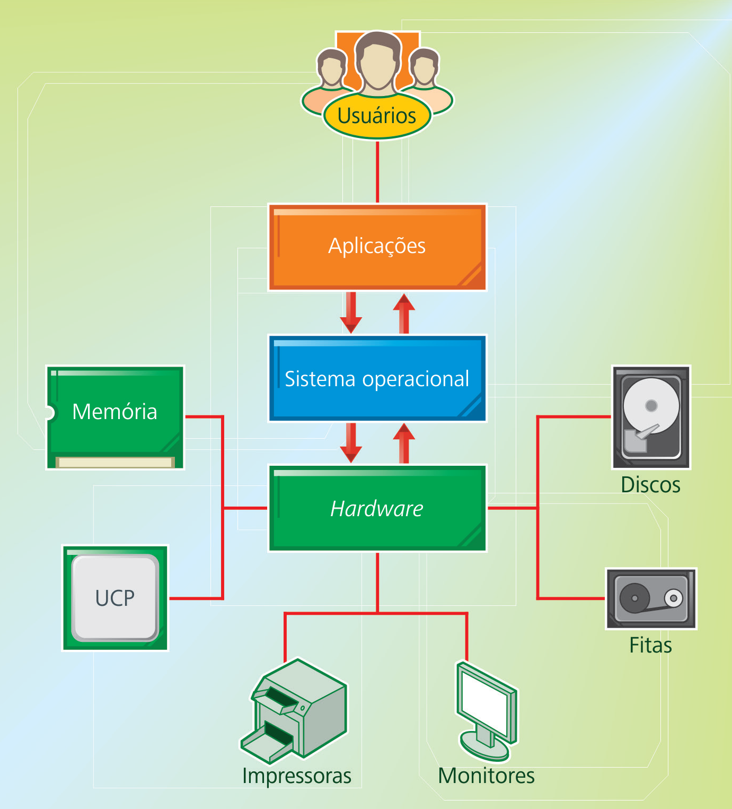

# Sistemas Operacionais

* Ementa: Conceitos de Sistemas Operacionais. Histórico dos Sistemas Operacionais. Principais Características de um S.O. Gerenciamento de Processos. Gerenciamento de Memória. Gerenciamento de E/S. Sistema de Arquivos. Segurança e Proteção. Programação Concorrente. Deadlock. Sistemas Distribuídos. Chamadas de Sistemas e API.

* Objetivo: Capacitar o aluno a entender os principais conceitos de sistemas operacionais modernos.

* Competências
  - Identificar os componentes do sistema operacional.
  - Compreender os principais componentes de um sistema operacional.
  - Compreender os algoritmos usados na gerência de subsistemas do SO.
  - Analisar as características de um sistema operacional.

<!--

Structuring the slide show

By default, the slide level is the highest heading level in the hierarchy that is followed immediately by content, and not another heading, somewhere in the document. In the example above, level-1 headings are always followed by level-2 headings, which are followed by content, so the slide level is 2. This default can be overridden using the --slide-level option.

The document is carved up into slides according to the following rules:

    * A horizontal rule always starts a new slide.

    * A heading at the slide level always starts a new slide.

    * Headings below the slide level in the hierarchy create headings within a slide.

    * Headings above the slide level in the hierarchy create “title slides,” which just contain the section title and help to break the slide show into sections. Non-slide content under these headings will be included on the title slide (for HTML slide shows) or in a subsequent slide with the same title (for beamer).

    A title page is constructed automatically from the document’s title block, if present. (In the case of beamer, this can be disabled by commenting out some lines in the default template.)

These rules are designed to support many different styles of slide show. If you don’t care about structuring your slides into sections and subsections, you can just use level-1 headings for all each slide. (In that case, level-1 will be the slide level.) But you can also structure the slide show into sections, as in the example above.

-->
---------------

## Programação das aulas

**Aula 1** - Conceitos de SOs: funções básicas, caracterização e principais
tipos de sistemas operacionais.

**Aula 2** - Conceitos de HW e SW que interagem diretamente com os SOs.

**Aula 3** - Estrutura do Sistema Operacional com ênfase para as funções do
núcleo do sistema, modos de acesso e rotinas do SO.

**Aula 4** - Processos e suas formas de gerenciamento.

**Aula 5** - Gerenciamento da memória, técnicas de alocação.

**Aula 6** - Gerenciamento de arquivos: organização de arquivos e diretórios,
técnicas de alocação de espaço disco.

**Aula 7** - SO MS Windows 7 e suas ferramentas de administração

**Aula 8** - Linux Ubuntu: organização ferramentas de sistema e principais
comandos para administração.

------------------------------------------------------------------------------

-------
 **Aula 1 - Introdução aos Sistemas Operacionais**
-------

## Objetivos

* Apresentar as funções básicas e caracterizar um SO

* Mostrar os principais tipos de sistemas operacionais existentes

* Conhecer os sistemas operacionais

## Funções básicas e caracterização

* Um SO pode ser caracterizado como um conjunto de rotinas executadas pelo
processador, de forma semelhante aos programas dos usuários.

* O principal objetivo do SO é gerenciar os componentes de HW, como processador,
memória principal, discos, teclado, ... e fornecer aos programas do usuário
uma interface com o HW mais simples.

* A principal diferença entre SWs aplicativos e o SO está no fato de que os dois
funcionam de formas diferentes:

  - um SW aplicativo trabalha com início, meio e fim;
  - um SO trabalha de forma assíncrona, suas rotinas são executadas de forma
assíncrona e, muitas vezes, de forma concorrente.

-------------------------------------------------------------------------------

## Tipos de sistemas operacionais

- sistemas monoprogramáveis/monotarefa
- sistemas multiprogramáveis/multitarefa
- sistemas com múltiplos processadores

## Sistemas Monoprogramáveis/monotarefa

Execução de uma única tarefa/programa de cada vez.

Características:

- O único programa que está em execução tem acesso exclusivo a todos os
recursos do computador: processador, memória, entradas e saídas.
- Outras aplicações precisam esperar o final da aplicação atual para poder
executar.
- Má utilização dos recursos do computador.
- Exemplos de SOs monoprogramáveis: sistemas anteriores a 1960, MS-DOS, alguns
sistemas de automação.

## Sistemas Multiprogramáveis/Multitarefa

- Os recursos de um computador são compartilhados entre diversos usuários \(
  *multiuser* \) e diversas aplicações.
- O SO gerencia todos os recursos compartilhados. Os aplicativos não acessam
os recursos compartilhados diretamente, só através de rotinas \(chamadas de
  sistema\) do SO.
- Melhor utilização dos recursos do computador.
- Sistemas muito mais complexos. O processador pode ser compartilhado por:
  + multiprogramação cooperativa: quando uma aplicação espera por um evento, ela
  libera o processador para outra aplicação \(MS-Windows anteriores à versão
  3.1\)
  + multiprogramação por tempo compartilhado: cada aplicação executar um tempo
  máximo \(quantum\), se ela não termina nesse tempo, vai para uma *fila de
  espera pelo processador* e libera o processador para outra aplicação.

## Sistemas de Tempo Real

Tipo especial de sistema multitarefa, estes sistemas têm restrições de tempo de
execução. Existem 2 tipos de sistemas de tempo real:

- *tempo real leve* \(*soft real time*\) - se as restrições de tempo não são
atendidas, nada fatal ocorre, mas os resultados do processamento são
deteriorados. Exemplo: aplicações de multimídia.
- *tempo real restrito* \(*hard real time*\) - se as restrições de tempo real não
são atendidas, pode resultar em danos fatais, inclusive com riscos de perdas
de vida humana. Exemplos: sistemas de automação, sistemas para procedimentos
\(cirurgias\) médicos.

## Sistemas com Múltiplos Processadores \(multiprocessadores\)
